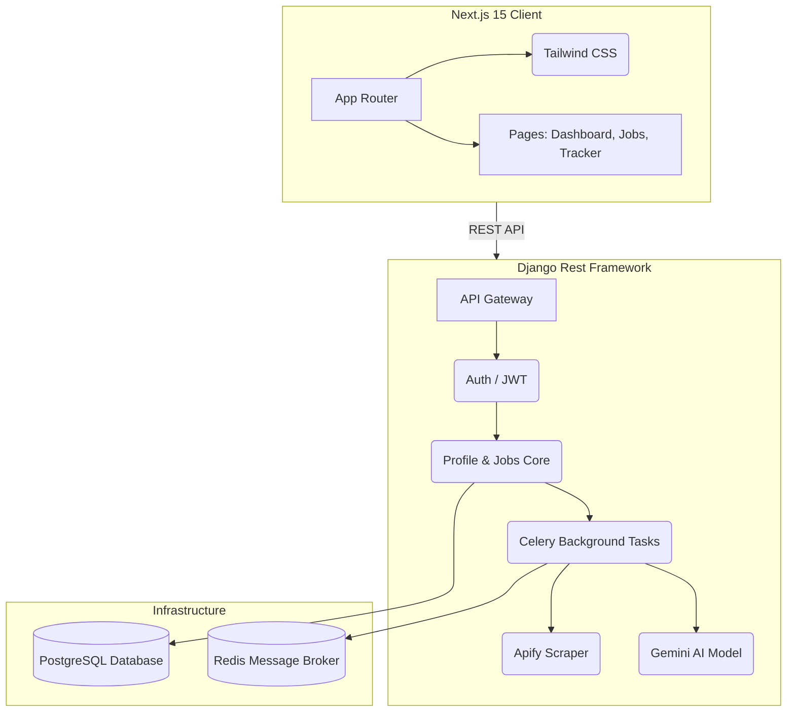

<div align="center">

# 🚀 JobPilot AI

**Your AI-Powered Job Discovery & Application Engine**

[](https://nextjs.org/)
[](https://www.djangoproject.com/)
[](https://tailwindcss.com/)
[](https://www.postgresql.org/)
[](https://docs.celeryq.dev/)

*Automatically discover, match, and apply to top engineering roles with the power of Gemini AI.*

---

</div>

## 📖 Table of Contents

- [✨ Features](#-features)
- [🏗️ Architecture](#️-architecture)
- [🛠️ Tech Stack](#️-tech-stack)
- [🚀 Getting Started](#-getting-started)
  - [Prerequisites](#prerequisites)
  - [Backend Setup](#backend-setup)
  - [Frontend Setup](#frontend-setup)
- [🔌 API Reference](#-api-reference)
- [🤖 AI Integration](#-ai-integration)

---

## ✨ Features

- **Smart Job Aggregation:** Automated background scraping of jobs from Apify (LinkedIn, remote boards).
- **AI Resume Parsing:** Upload your PDF resume, and let the Gemini LLM extract your skills, education, and experience.
- **Deep Match Scoring:** Automatically calculate compatibility scores between your profile and new job postings.
- **One-Click Cover Letters:** Generate highly personalized cover letters tailored specifically to a job description using AI.
- **Application Tracking Board:** Manage your active job search via a sleek, drag-and-drop Kanban interface.
- **Premium SaaS Aesthetic:** Beautifully designed glassmorphic UI built with Next.js 15, Tailwind CSS v4, and Lucide React.

---

## 🏗️ Architecture



---

## 🛠️ Tech Stack

### Frontend
- **Framework:** Next.js 15 (App Router)
- **Language:** TypeScript
- **Styling:** Tailwind CSS v4
- **Icons:** Lucide React

### Backend
- **Framework:** Django 6 + Django Rest Framework (DRF)
- **Language:** Python 3.13
- **Authentication:** JWT (SimpleJWT)
- **Background Jobs:** Celery + Redis

### AI & Data
- **LLM Engine:** Google Gemini (1.5 Flash)
- **Scraping:** Apify Client

---

## 🚀 Getting Started

Follow these steps to set up the project locally.

### Prerequisites

Ensure you have the following installed:
- [Node.js](https://nodejs.org/) (v18 or higher)
- [Python](https://www.python.org/) (3.11+)
- [PostgreSQL](https://www.postgresql.org/)
- [Redis](https://redis.io/) (for Celery message broker)

### Backend Setup

1. **Navigate to the backend directory and activate your virtual environment:**
   ```bash
   cd backend
   python -m venv venv
   # Windows:
   .\venv\Scripts\activate
   # macOS/Linux:
   source venv/bin/activate
   ```

2. **Install dependencies:**
   ```bash
   pip install -r requirements.txt
   # (If requirements.txt is missing, install the core libs via pip)
   pip install django djangorestframework psycopg2-binary celery redis django-cors-headers djangorestframework-simplejwt apify-client google-generativeai
   ```

3. **Configure Environment Variables:**
   Set up your `GEMINI_API_KEY` for AI features:
   ```bash
   export GEMINI_API_KEY="your-gemini-api-key"
   ```

4. **Run Migrations:**
   ```bash
   python manage.py makemigrations
   python manage.py migrate
   ```

5. **Start the Development Servers:**
   You will need two terminals.
   
   *Terminal 1 (Django Server):*
   ```bash
   python manage.py runserver
   ```
   
   *Terminal 2 (Celery Worker):*
   ```bash
   celery -A jobpilot worker --loglevel=info -P gevent
   ```

### Frontend Setup

1. **Navigate to the frontend directory:**
   ```bash
   cd frontend
   ```

2. **Install dependencies:**
   ```bash
   npm install
   ```

3. **Start the development server:**
   ```bash
   npm run dev
   ```

4. **View the App:**
   Open [http://localhost:3000](http://localhost:3000) in your browser.

---

## 🔌 API Reference

The backend exposes a comprehensive RESTful API:

| Method | Endpoint | Description |
|--------|----------|-------------|
| `POST` | `/api/auth/register/` | Register a new user |
| `POST` | `/api/auth/login/` | Retrieve JWT access and refresh tokens |
| `GET` | `/api/profile/` | Fetch the authenticated user's profile and extracted skills |
| `GET` | `/api/jobs/` | Search and filter aggregated jobs |
| `GET` | `/api/applications/` | Retrieve application tracking history |
| `POST` | `/api/applications/<id>/generate_cover_letter/` | Trigger AI to generate a cover letter |

---

## 🤖 AI Integration

JobPilot utilizes **Google's Gemini Model** natively within the Django backend. 
- **Resume Parsing:** Located in `backend/core/tasks.py`, the AI ingests raw text and outputs structured JSON (skills, timeline, education) mapping directly to the DB.
- **Cover Letter Generation:** Located in `backend/core/views.py`, it leverages the user's extracted skills and the job's description to synthesize a hyper-personalized pitch.

<div align="center">
  <i>Built with ❤️ for Software Engineers</i>
</div>
